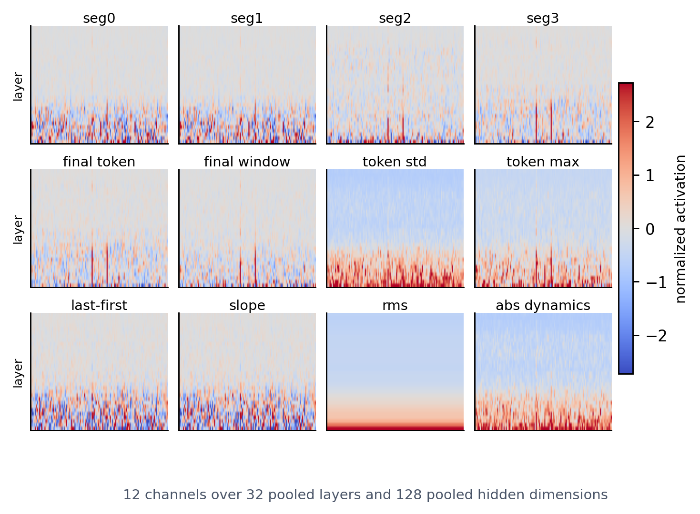

# ActMap

This repository contains the code used for the ActMap experiments. ActMap is a white-box uncertainty signal for short-answer language-model generations: it records the hidden states produced while a model writes an answer, compresses that trajectory into a fixed activation map, and trains a compact ViT2D classifier to predict answer correctness.

The map has twelve temporal channels over 32 pooled layers and 128 pooled hidden-dimension bins. The classifier does not read or decode the answer text. It only sees the activation summary for the generated answer.

Raw trajectories are adaptively pooled to the same `12 x 32 x 128` shape across the evaluated 8B-class LLMs. This keeps more structure than a single hidden-state vector: the ViT can compare early and late layers, local hidden-dimension regions, final-token states, late-window summaries, temporal slopes, and token-to-token dynamics.

The experiments compare ActMap with supervised white-box probes and black-box confidence heuristics on TriviaQA, NQ-Open, WebQuestions, and GSM8K.

## Core Code

- `src/activations.py`: hidden-state collection and ActMap construction.
- `src/build_train.py`: dataset generation for short-answer benchmarks.
- `src/evaluation.py`: answer normalization and correctness labeling.
- `src/vit.py`: ViT2D training, checkpointing, and evaluation.
- `src/black.py`: black-box uncertainty baselines.
- `src/white.py`: white-box probe baselines.
- `src/check_actmaps.py`: dataset and activation-map sanity checks.
